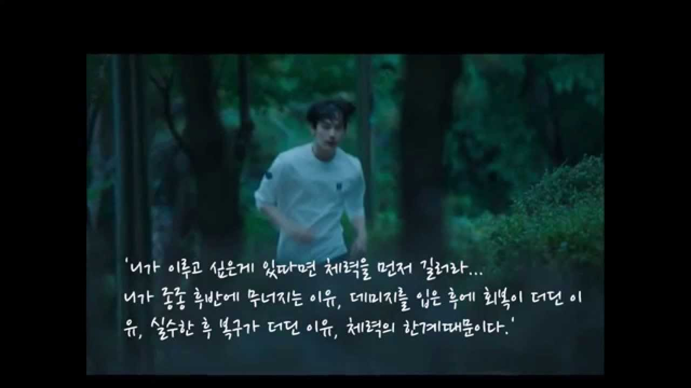

# Dongwon's healthyExercise Project

운동하자 운동 조금씩이라도 건강해지자

| INDEX | Date                 | Content                                                                      | 특이사항                                                                                                                                                                                                                                    |
| ----- | -------------------- | ---------------------------------------------------------------------------- | --------------------------------------------------------------------------------------------------------------------------------------------------------------------------------------------------------------------------------------- |
| 1     | april 18th           | 팔굽혀 펴기 50회 윗못일으키기 50회                                                        |                                                                                                                                                                                                                                         |
| 2     | april 19th           | 팔굽혀 펴기 50회 예비군 훈련 뜀걸음 사격, 일광욕 12000보 걸음, 8km, 38층                            |                                                                                                                                                                                                                                         |
| 3     | april 20th           | 팔굽혀 펴기 50회 윗못일으키기 80회 스쿼트 60개 8000보 걸음                                       |                                                                                                                                                                                                                                         |
| 4     | april 22th           | 팔굽혀 펴기 50회 스쿼트 50회 11500보 7.4 km, 37 층                                       | mother's day                                                                                                                                                                                                                            |
| 5     | april 23th           | 팔굽혀 펴기 60회 스쿼트 60회 5200보                                                     | 빠른취침 후 아침운동                                                                                                                                                                                                                             |
| 6     | april 24th           | 팔굽혀 펴기 70회 스쿼트 60회 옆못일으키기 35회 4000보                                          | 처음으로 컨디션이 굉장히 좋았음 잠을 많이 자서 그런지는 몰라도 운동의 효과가 있다고 느끼는중!                                                                                                                                                                                   |
| 7     | april 26th           | 팔굽혀 펴기 50회 스쿼트 60회 벤치프레스 60회 실시                                              | 오랜 만에 벤치프레스 실시 굉장히 시원하다 벤치는 사랑                                                                                                                                                                                                          |
| 8     | april 29th           | 팔굽혀 펴기 90회 플랭크 30초씩 2회 실시                                                    | 땀이 주륵주륵 팔굽혀 펴기 첨으로 원래 패턴 30x3으로 돌아왔다. 굉장히 힘들다.                                                                                                                                                                                          |
| 9     | april 30th           | 팔굽혀 펴기 90회 플랭크 40초씩 2회 실시                                                    | 오늘 조금 많이 걸었다 학교다녀오고 공부 많이해서                                                                                                                                                                                                             |
| 10    | may 2th              | 팔굽혀 펴기 60회                                                                   | 캡스톤 할거 때문에 운동 조금 밖에 못하고 바로 투입 ㅠㅠ                                                                                                                                                                                                      |
| 11    | may 4th              | 팔굽혀 펴기 60회 플랭크 60초                                                           |                                                                                                                                                                                                                                         |
| 12    | may 21th             | 버핏테스트 30회 뜀걸음 10분                                                            | 너무 오랜만에 운동을 했다. 나는 작심 3일은 아니고 작심 2주는 하는 것 같다. 휴.. 요즘 의지가 약해졌다. 의지를 다질필요가 있다. 조금 더 열심히 해보도록 하자. 다시 한번 운동화이팅!!                                                                                                                            |
| 13    | may 22th             | 팔굽혀 펴기 70회 스쿼트 50회                                                           | 빼먹지 말고 매일매일 하자!! 건강한 몸이 건강한 정신과 건강한 지식이 된다!                                                                                                                                                                                             |
| 14    | may 26th             | 자전거 신촌 다녀오기 40분                                                              | 오랜만에 유산소! 하지만 너무 더웟다 얼른 헬스장 다니고 싶다!                                                                                                                                                                                                     |
| 15    | July 20th            | 유산소 뜀걸음 30분, 팔굽혀 펴기 40회 벤치프레스 15회 4세트                                        | 두달만에 헬스장을 등록하고 운동을 다시 시작했다 나의 체력을 기르자 아자아자 체력이 국력이고 나의 집중력을 향상 시킬 것이고 나를 건강하게 이끌어 줄것이다.                                                                                                                                                 |
| 16    | July 23th            | 유산소 뜀걸음 30분, 팔굽혀 펴기 60회 벤치프레스 15회 4세트                                        | 주말 시간때와 약속 때문에 쉬고 시간을 파악하고 예전과 같이 시간을 유지했다. 30분 뛰기가 생각보다 쉽지가 않다 좀더 노력해보자. 그리고 팔굽혀 펴기 갯수를 더 늘렸다. 그래서 20*3회를 실시 했다. 조금씩 개수를 늘려나가서 30*3을 실행하도록 하자.                                                                                         |
| 17    | July 26th            | 팔굽혀펴기 20*3회 inBody 체크, 벤치프레스 15*3회, 다리운동 3가지 3세트 씩 실시                        | 오랜만인가? 처음인가 모르겠는데 인바디를 하였다. 체크하면서 선생님께서 굉장히 놀라셨다. 근육이 굉장히 적다고 하셨다. 예전에 내가 했던 다이어트의 위험함을 일 깨워 주셨다. 그렇게 하면 안된다고 하시면서 말씀해 주셨다. 내가 한 방법은 근육이 다 빠지는 다이어트라 긍육을 키우며 하는 방법에 대해서 일러 주셨다. 그러면서 하체 운동을 열심히 할 필요성을 강조해 주셔서 오늘부터 하체운동에 박차를 가하기로 하였다. |
| 18    | July 27th            | 유산소 20분 팔굽혀 펴기 70회 벤치프레스 3세트, 하체운동 3가지 15회씩 3세트 실시                           | 아침운동을 다녀왔다. 아침 8시 조금 넘어서 다녀오니까 하루가 굉장히 긴 느낌이다. 아침에 운동을 해서 땀을 흘리니까 건강해지고 몸이 가볍다. 단 점심시간 이후에 졸음이 쏟아지는 단점이....ㅋㅋㅋㅋ 조금더 체력을 키우도록하자!!                                                                                                    |
| 19    | July 28th saturday   | 유산소 30분 팔굽혀 펴기 30,20,20 성공!, 하체운동 후 빠른 귀가                                    | Open saturday! 토요일에 더위와 함께 운동을 하였다. 예전 헬스장들은 토요일은 운영을 하지않아서 한적이 거의 없는데 이 헬스장은 일요일까지 운영을 한다 굉장히 좋다 &#128525; 토욜일이라 무리하지않고 유산소 위주로 진행하였다. 다음주는 또다시 근력운동 위주로 해보잣                                                                           |
| 20    | August 4th saturday  | 유산소 25분 팔굽혀 펴기 80회 하체운동 3세트 턱걸이 5회씩 3회 실시                                    | 날씨가 정말 덥다 시간도 빨리 흐르는 만큼 놓치지 말고 운동하도록하자                                                                                                                                                                                                  |
| 21    | August 6th saturday  | 유산소 30분 팔굽혀 펴기 90회, 벤치프레스 3세트, UpperChest 3세트                                | 주말에 이어서 월요일도 운동!! 간만에 일과에 맞춘 하루였다. 긍정정이고 매일 쌓아나가도록 하자                                                                                                                                                                                   |
| 22    | August 6th monday    | 유산소 30분 팔굽혀펴기 90회, 벤치프레스 3세트, 윗가슴 벤치프레스 3세트, 하체 프레스 30회                      | 부모님이랑 저녁먹고 먹은만큼 빼기!! 빠뜨리지 말고 체력을 열심히 기르자                                                                                                                                                                                                |
| 23    | August 8th wednesday | 아침 운동 유산소 생략 (ㅠㅠ), 팔굽혀 펴기 90회, 하체운동 3세트, 턱걸이 15회 (턱걸이가 제일 힘들다.), 벤치프레스 3세트 | 아침 운동은 하루가 지치는 감이 있어서 유산소를 생략하고 근력운동 위주로 했다. 단단해지는 느낌!! 주말 서핑 여행을 위해 열심히 달려보자                                                                                                                                                           |
| 24    | August 16th          | 뜀걸음 30분, 팔굽혀 펴기 90개 스쿼트 30개 턱걸이 매달려있기 6회                                     | 오늘 다솔이 이삿짐 도와주는 날이었는데 아침 운동을 무리하게 해서 힘이 굉장히 빠진상태로 일을 하였다. 5시간 정도 열심히 나르고 하다보니 근력이 강해진 느낌이다.                                                                                                                                             |
| 25    | August 24th          | 턱걸이 6세트, 팔굽혀 펴기, 어깨운동 실시                                                     | 오랜만에 운동을 하였다. 어깨운동을 해서 그런지 어깨가 꽉끼는 느낌이다. 코어운동의 중요성이 느껴진다.                                                                                                                                                                               |
| 26    | september 1th        | 팔굽혀 펴기 90회, 하체운동 실시 하체세트 3세트, 턱걸이 7회x3                                       | 눈썹 문신 때문에 5일동안 운동을 하지 못하였다. 못한 것 치고는 몸이 가벼운 편이라 운동이 잘된듯 하다. 하체를 하니깐 확실히 상체 힘이 남는다. 공부하기 유용한듯!                                                                                                                                           |
| 27    | september 10 th      | 팔굽혀 펴기 90회, 어깨운동 set, 턱걸이, 벤치프레스, 아령 운동, 숄더 프레스                              | 드디어 턱걸이를 나도 할수 있게 되었다. 정말 1개도 못하던 턱걸이 였는데 역시 운동하면 되고 노력하면 배신하지 않는다. 턱걸이 3세트 가즈아                                                                                                                                                         |
| 28    | september 12th       | 팔굽혀 펴기 90회, 가슴운동 set, 벤치프레스, 윗가슴 운동, 체스트 프레스                                 | 저번주 운동을 전혀 기록하지 못하였다. 벌써 일주일에 2번을 갔다. 3번은 지키면 좋겟는데.. 어제는 AMP 로스쇼 다녕오고 오늘은 배달의 민족 코딩 테스트 3개중 1개 밖에 풀지 못하였다. 운동만큼 지식도 향상시키자                                                                                                               |
| 29    | september 18th       | 팔굽혀 펴기 90회, 턱걸이 5세트 !! 어깨운동 실시, 간만에 나의 장기인 윗몸일으키기                            | 드디어 내가 턱걸이를 5세트를 하였다. 턱걸이를 하나도 못하는 나였는데 덕분에 어깨도 넓어진거 같고 몸이 커진것 같다. 굉장히 기쁘다. 확실히 기분이 안좋다가도 운동을 하면 기분이 좋아진다. 운동을 꾸준히 하도록 하자.                                                                                                              |

| 30 | september 22th | 팔굽혀 펴기 90회, 데드리프트 2종류 3세트, 스쿼트 3세트, 턱걸이 3세트, 벤치프레스 3세트 | 오늘은 코어 운동 중심으로 진행을 해보았다. 처음으로 만들어본 코스인데 오랜만에 운동을 할때 사용하면 좋을 것 같다. 오늘부터 추석이다 명절 잘보내고 오도록하자 너무 많이 먹지 말기! | 